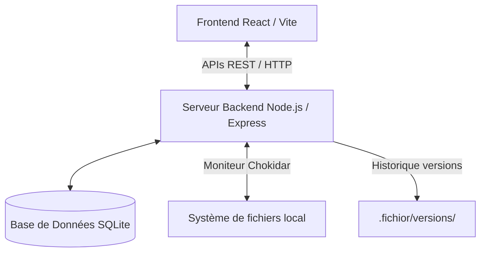

# 📝 Contexte du Projet - Fichior

Ce document récapitule le contexte de l'application **Fichior**, son architecture actuelle, l'état de son développement et les perspectives d'évolution.

---

## 🌟 Origine & Vision

Fichior est né de la volonté de concevoir un gestionnaire de fichiers pour Linux (en particulier pour remplacer Nautilus) offrant des fonctionnalités de recherche plus puissantes et intuitives. 

L'accent a été mis sur **l'esthétique moderne** (thème sombre, glassmorphism, animations fluides), la **vitesse d'accès** (recherche par raccourci Raycast-style) et le **moteur d'indexation intelligent** capable de comprendre le langage naturel et d'extraire les données enfouies au cœur des fichiers (texte intégral, EXIF, ID3).

---

## 🏗️ Architecture Technique

Fichior utilise une architecture locale client-serveur ultra-légère :

### Répartition des Rôles :
* **Base de données (`fichior.db`)** : Contient l'index complet des fichiers (noms, chemins, types, mtime, taille, hashs, métadonnées EXIF/ID3 et le plein texte extrait).
* **Watchdog daemon (`watchdog.js`)** : Démarre des processus de surveillance indépendants (`chokidar`) sur les dossiers choisis (ex: `Downloads`) pour trier automatiquement les fichiers selon vos extensions et tags.
* **Moteur d'indexation (`indexer.js`)** : Analyse en tâche de fond les fichiers modifiés et utilise des parsers (`pdf-parse`, `mammoth` pour Word, `music-metadata` pour l'audio et `exif-parser` pour les photos) afin de remplir l'index.

---

## 📊 État Actuel du Développement (v1.0.0)

Toutes les fonctionnalités initiales spécifiées dans le cahier des charges ont été développées, testées et validées.

### 🔍 Recherche & Méta (100% Terminés)
* [x] Compilateur NLP (`natural_language.js`) traduisant le langage naturel (ex: `"PDF > 5 Mo"`) en requêtes SQL.
* [x] Moteur de recherche floue (Fuzzy) & plein texte (Full-text).
* [x] Dossiers virtuels intelligents (Smart Folders).
* [x] Extraction automatique des métadonnées EXIF (photos) et ID3 (musique).

### 🏷️ Organisation & Historique (100% Terminés)
* [x] Système de tags personnalisés avec couleurs éditables depuis l'inspecteur.
* [x] Éditeur de notes et commentaires textuels par fichier.
* [x] Système de versioning local à 3 niveaux (sauvegardes automatiques avant écrasement).

### 🛠️ Productivité (100% Terminés)
* [x] Panier de staging (Staging Area) pour regrouper les fichiers multi-dossiers.
* [x] Renommage en lot intelligent avec aperçu direct (gestion préfixes, suffixes, casse, et Regex).
* [x] Analyseur et nettoyeur de doublons basé sur le hash numérique MD5.

### 💻 Expérience Utilisateur & Automatisation (100% Terminés)
* [x] Aperçu rapide (Quick Look via la touche `Espace`) pour le code, markdown, audio, vidéo et images.
* [x] Mode Focus / Spotlight (`Ctrl + F` ou `Ctrl + Espace`) avec fenêtre de recherche flottante.
* [x] Watchdog : Gestion de règles "Si ... Alors ..." paramétrables depuis l'interface.
* [x] Création du paquet de déploiement d'application Debian `.deb`.
