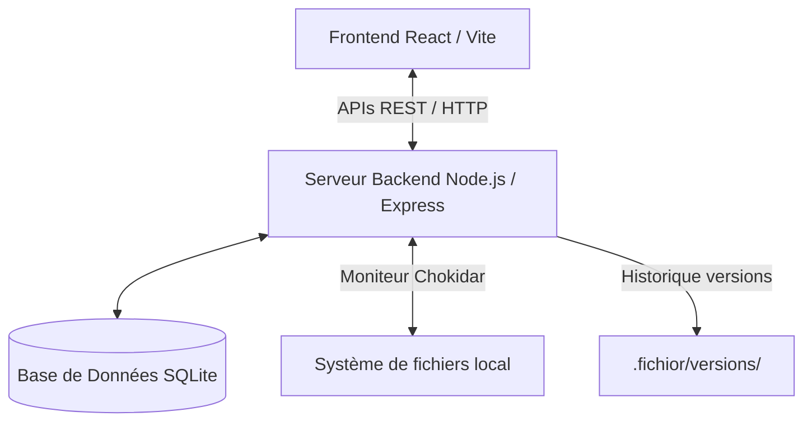

# 📝 Contexte du Projet - Fichior

Ce document récapitule le contexte de l'application **Fichior**, son architecture actuelle, l'état de son développement et les perspectives d'évolution.

---

## 🌟 Origine & Vision

Fichior est né de la volonté de concevoir un gestionnaire de fichiers pour Linux (en particulier pour remplacer Nautilus) offrant des fonctionnalités de recherche plus puissantes et intuitives. 

L'accent a été mis sur **l'esthétique moderne** (thème sombre, glassmorphism, animations fluides), la **vitesse d'accès** (recherche par raccourci Raycast-style) et le **moteur d'indexation intelligent** capable de comprendre le langage naturel et d'extraire les données enfouies au cœur des fichiers (texte intégral, EXIF, ID3).

---

## 🏗️ Architecture Technique

Fichior utilise une architecture locale client-serveur ultra-légère :

### Répartition des Rôles :
* **Base de données (`fichior.db`)** : Contient l'index complet des fichiers (noms, chemins, types, mtime, taille, hashs, métadonnées EXIF/ID3 et le plein texte extrait).
* **Watchdog daemon (`watchdog.js`)** : Démarre des processus de surveillance indépendants (`chokidar`) sur les dossiers choisis (ex: `Downloads`) pour trier automatiquement les fichiers selon vos extensions et tags.
* **Moteur d'indexation (`indexer.js`)** : Analyse en tâche de fond les fichiers modifiés et utilise des parsers (`pdf-parse`, `mammoth` pour Word, `music-metadata` pour l'audio et `exif-parser` pour les photos) afin de remplir l'index.

---

## 📊 État Actuel du Développement (v2.0.0 - Native Desktop)

L'application a franchi des étapes majeures vers une expérience desktop complète et connectée.

### 🔍 Recherche & Méta (100% Terminés)
* [x] Compilateur NLP (`natural_language.js`) traduisant le langage naturel.
* [x] Moteur de recherche floue (Fuzzy) & plein texte (Full-text).
* [x] Dossiers virtuels intelligents (Smart Folders).
* [x] Extraction automatique des métadonnées EXIF et ID3.
* [x] **Nouveau (v1.3.0)** : Recherche unifiée incluant **Google Drive** et **Dropbox**.

### 🏷️ Organisation & Historique (100% Terminés)
* [x] Système de tags personnalisés avec couleurs éditables.
* [x] Éditeur de notes et commentaires textuels par fichier.
* [x] Système de versioning local à 3 niveaux.

### 🛠️ Productivité & UI (100% Terminés)
* [x] Panier de staging (Staging Area).
* [x] Renommage en lot intelligent avec aperçu direct.
* [x] Analyseur et nettoyeur de doublons (MD5).
* [x] Vue en Liste et Vue en Grille.
* [x] **Nouveau (v1.2.0)** : Support du **Drag & Drop** système (Importation, Déplacement, Tags).

### 💻 Expérience Utilisateur & Distribution (100% Terminés)
* [x] Aperçu rapide (Quick Look via `Espace`).
* [x] Mode Focus / Spotlight (`Ctrl + F`).
* [x] Watchdog : Gestion de règles "Si ... Alors ...".
* [x] **Nouveau (v1.5.0)** : Système de **Plugins** pour parsers personnalisés (`~/.fichior/plugins/`).
* [x] **Nouveau (v2.0.0)** : Migration vers une **Application Desktop Native** via **Electron**.
* [x] Création de paquets `.deb` et `AppImage` via `electron-builder`.

---

## 🚀 Démarrer un nouveau développement

Lorsqu'on reprend le développement de Fichior, voici les points à vérifier :

1.  **Environnement** : Assurez-vous d'avoir Node.js v18+.
2.  **Installation** : `npm install` installe les dépendances backend et frontend.
3.  **Lancement Dev** : `npm run dev` pour le frontend (Vite) et `node server.js` (ou `npm run start`) pour le backend.
4.  **Base de données** : Elle se trouve dans `~/.fichior/fichior.db`. En cas de corruption ou pour repartir de zéro, vous pouvez supprimer ce dossier.
5.  **Build** : Toujours exécuter `npm run build` avant de lancer `build_deb.sh` pour s'assurer que les derniers changements frontend sont inclus dans le paquet Debian.
